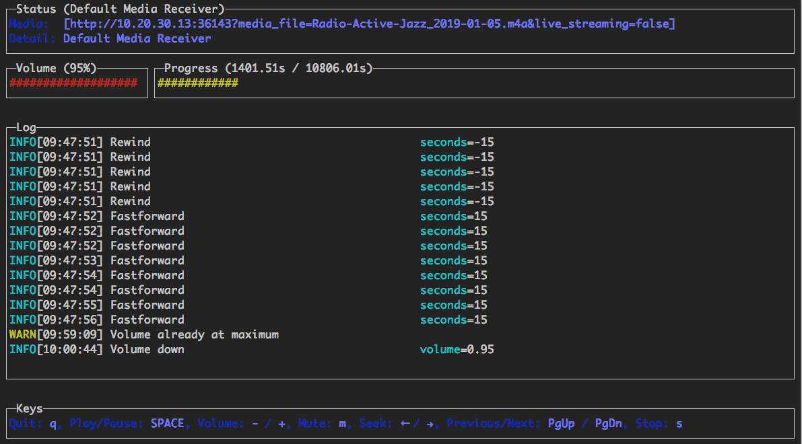

# Chromecast

Implements a basic number of the google chromecast commands. Other than the basic commands, it also allows you to play media files from your computer either individually or in a playlist; the `playlist` command will look at all the files in a folder and play them sorted by numerically.

## Media Content Playable

Can play / load a local media file on your chromecast.

```
Supported Media formats:
    - MP3
    - AVI
    - MKV
    - MP4
    - WebM
    - FLAC
```

If an unknown file is found, it will use `ffmpeg` to transcode it to MP4, and stream it to the chromecast.

## Play Local Media Files

We are able to play local media files by creating a http server that will stream the media file to the cast device.

## Cast DNS Lookup

A DNS multicast is used to determine the Chromecast and Google Home devices.

The cast DNS entry is also cached, this means that if you pass through the device name, `-n <name>`, or the
device uuid, `-u <uuid>`, the results will be cached and it will connect to the chromecast device instanly.

## Installing

### Install binaries
https://github.com/vishen/go-chromecast/releases

### Install the usual Go way:

```
$ go get -u github.com/vishen/go-chromecast
```

## Commands

```
Control your Google Chromecast or Google Home Mini from the
command line.

Usage:
  go-chromecast [command]

Available Commands:
  help        Help about any command
  load        Load and play media on the chromecast
  ls          List devices
  next        Play the next available media
  pause       Pause the currently playing media on the chromecast
  playlist    Load and play media on the chromecast
  previous    Play the previous available media
  restart     Restart the currently playing media
  rewind      Rewind by seconds the currently playing media
  seek        Seek by seconds into the currently playing media
  status      Current chromecast status
  stop        Stop casting
  tts         text-to-speech
  ui          Run the UI
  unpause     Unpause the currently playing media on the chromecast
  volume      Get or set volume
  watch       Watch all events sent from a chromecast device

Flags:
  -a, --addr string          Address of the chromecast device
      --debug                debug logging
  -d, --device string        chromecast device, ie: 'Chromecast' or 'Google Home Mini'
  -n, --device-name string   chromecast device name
      --disable-cache        disable the cache
  -h, --help                 help for go-chromecast
  -i, --iface string         Network interface to use
  -p, --port string          Port of the chromecast device if 'addr' is specified (default "8009")
  -u, --uuid string          chromecast device uuid
      --with-ui              run with a UI

Use "go-chromecast [command] --help" for more information about a command.
```

## Usage
```
# View available cast devices.
$ go-chromecast ls
Found 2 cast devices
1) device="Chromecast" device_name="MarieGotGame?" address="192.168.0.115:8009" status="" uuid="b380c5847b3182e4fb2eb0d0e270bf16"
2) device="Google Home Mini" device_name="Living Room Speaker" address="192.168.0.52:8009" status="" uuid="b87d86bed423a6feb8b91a7d2778b55c"

# Status of a cast device.
$ go-chromecast status
Found 2 cast dns entries, select one:
1) device="Chromecast" device_name="MarieGotGame?" address="192.168.0.115:8009" status="" uuid="b380c5847b3182e4fb2eb0d0e270bf16"
2) device="Google Home Mini" device_name="Living Room Speaker" address="192.168.0.52:8009" status="" uuid="b87d86bed423a6feb8b91a7d2778b55c"
Enter selection: 1
Idle (Backdrop), volume=1.00 muted=false

# Specify a cast device name.
$ go-chromecast status -n "Living Room Speaker"
Idle, volume=0.17 muted=false

# Specify a cast device by ip address.
$ go-chromecast status -a 192.168.0.52
Idle, volume=0.17 muted=false

# Specify a cast device uuid.
$ go-chromecast status -u b87d86bed423a6feb8b91a7d2778b55c
Idle (Default Media Receiver), volume=0.17 muted=false

# Load a local media file (can play both audio and video).
$ go-chromecast load ~/Downloads/SampleAudio_0.4mb.mp3
Found 2 cast dns entries, select one:
1) device="Chromecast" device_name="MarieGotGame?" address="192.168.0.115:8009" status="" uuid="b380c5847b3182e4fb2eb0d0e270bf16"
2) device="Google Home Mini" device_name="Living Room Speaker" address="192.168.0.52:8009" status="" uuid="b87d86bed423a6feb8b91a7d2778b55c"
Enter selection: 2

# Status of cast device running an audio file.
$ go-chromecast status
Found 2 cast dns entries, select one:
1) device="Chromecast" device_name="MarieGotGame?" address="192.168.0.115:8009" status="" uuid="b380c5847b3182e4fb2eb0d0e270bf16"
2) device="Google Home Mini" device_name="Living Room Speaker" address="192.168.0.52:8009" status="Default Media Receiver" uuid="b87d86bed423a6feb8b91a7d2778b55c"
Enter selection: 2
Default Media Receiver (PLAYING), unknown, time remaining=8s/28s, volume=1.00, muted=false

# Play a playlist of media files.
$ go-chromecast playlist ~/playlist_test/ -n "Living Room Speaker"
Attemping to play the following media:
- /home/jonathan/playlist_test/SampleAudio_0.4mb.mp3
- /home/jonathan/playlist_test/sample_1.mp3

# Select where to start a playlist from.
$ go-chromecast playlist ~/playlist_test/ -n "Living Room Speaker" --select
Will play the following items, select where to start from:
1) /home/jonathan/playlist_test/SampleAudio_0.4mb.mp3: last played "2018-11-25 11:17:25 +0000 GMT"
2) /home/jonathan/playlist_test/sample_1.mp3: last played "2018-11-25 11:17:28 +0000 GMT"
Enter selection: 2
Attemping to play the following media:
- /home/jonathan/playlist_test/sample_1.mp3

# Start a playlist from the start, ignoring if you have previously played that playlist.
$ go-chromecast playlist ~/playlist_test/ -n "Living Room Speaker" --continue=false

# Start a playlist and launch the terminal ui
$ go-chromecast playlist ~/playlist_test/ -n "Living Room Speaker"  --with-ui

# Pause the playing media.
$ go-chromecast pause

# Continue playing the currently playing media.
$ go-chromecast play

# Play the next item in a playlist.
$ go-chromecast next

# Play the previous item in a playlist.
$ go-chromecast previous

# Rewind the currently playing media by x seconds.
$ go-chromecast rewind 30

# Go forward in the currently playing media by x seconds.
$ go-chromecast seek 30

# Get the current volume level
$ go-chromecast volume

# Set the volume level
$ go-chromecast volume 0.55

# View what a cast device is sending out.
$ go-chromecast watch

# Use a terminal UI to interact with the cast device
$ go-chromecast ui
```

## User Interface



A basic terminal user-interface is provided, that supports the following controls:
* Quit: "q"
* Play/Pause: SPACE
* Volume: - / +
* Mute/Unmute: "m"
* Seek (15s): <- / ->
* Previous/Next: PgUp / PgDn
* Stop: "s"

It can be run in the following ways:

### Standalone

If you just want to remote-control a chromecast that is already playing something:

```
$ go-chromecast ui
```

### Playlist

Use the UI in combination with the `playlist` command (detailed above):

```
$ go-chromecast --with-ui playlist /path/to/directory
```

### Load

Use the UI in combination with the `load` command (detailed above):

```
$ go-chromecast --with-ui load /path/to/file.flac
```

## Playlist

There is support for playing media items as a playlist.

If playing from a playlist, you are able to pass though the `--select` flag, and this will allow you to select
the media to start playing from. This is useful if you have already played some of the media and want to start
from one you haven't played yet.

A cache is kept of played media, so if you are playing media from a playlist, it will check to see what
media files you have recently played and play the next one from the playlist. `--continue=false` can be passed
through and this will start the playlist from the start.

## Watching a Device

If you would like to see what a device is sending, you are able to `watch` the protobuf messages being sent from your device:

```
$ go-chromecast watch
```

### Text To Speech

Experimental text-to-speech support has been added. This uses [Google
Cloud's Text-to-Speech](https://cloud.google.com/text-to-speech/) to
turn text into an mp3 audio file, this is then streamed to the device.

Text-to-speech api needs to be enabled https://console.cloud.google.com/flows/enableapi?apiid=texttospeech.googleapis.com and a google service account is required https://console.cloud.google.com/apis/credentials/serviceaccountkey

```
$ go-chromecast tts <message_to_say> --google-service-account=/path/to/service/account.json
```
